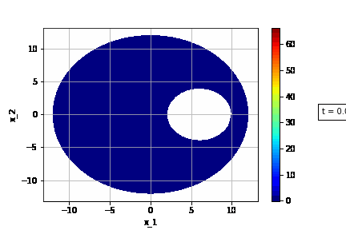

============
TorchPhysics
============

Welcome to **TorchPhysics**, a Python library of deep learning methods 
for solving differential equations. Currently, TorchPhysics implements
methods like PINN [1]_ and DeepRitz [2]_ which enable the user to

- solve ordinary and partial differential equations 
- train a neural network to approximate solutions for different parameters
- solve inverse problems and interpolate external data via the above methods

TorchPhysics can also be used in other deep learning approaches for differential
equations since it is built in a modular way. For example, TorchPhysics offers
a way to sample points in arbitrary, easy-to-define, domains flexibly.

Guide
=====
All kind of information (features, installation, etc.) to TorchPhysics can be
found under the **Overview** tab. 

As an introduction to TorchPhysics a **Tutorial** exists. There we will present and 
explain the most important aspects and structure of this library. Under the
**Examples** tab additional applications, in form of Jupyter Notebooks,
can be found.

.. toctree::
   :maxdepth: 2

   Overview <readme>
   Tutorial <tutorial/tutorial_start>
   Examples <examples>

API Reference
=============
Information for all classes, functions and methods can be found in
the following documentation:

.. toctree::
   :maxdepth: 2
   :caption: API

   Conditions <api/torchphysics.problem.conditions>
   Domains <api/torchphysics.problem.domains>
   Models <api/torchphysics.models>
   Sampler <api/torchphysics.problem.samplers>
   Solver <api/torchphysics>
   Spaces <api/torchphysics.problem.spaces>
   Utils <api/torchphysics.utils>

Bibliography
============
.. [1] Raissi, Perdikaris und Karniadakis, “Physics-informed neuralnetworks: A deep learning framework for solving forward and inverseproblems involving nonlinear partial differential equations”, 2019.
.. [2] E and Yu, "The Deep Ritz method: A deep learning-based numerical algorithm for solving variational problems", 2017

Indices and tables
==================

* :ref:`genindex`
* :ref:`modindex`
* :ref:`search`
