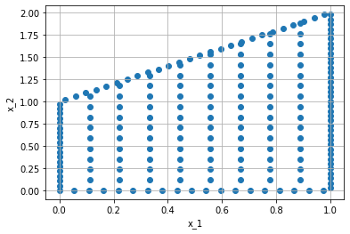
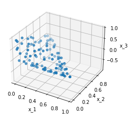
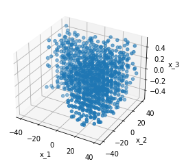
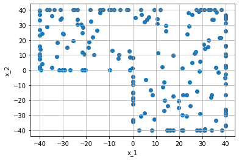

=============================
Polygons and External Objects
=============================
Thanks to a soft dependency on Shapely_ and Trimesh_, polygons and polyhedrons can be
created. For this, two additional domains exist: ``ShapelyPolygon`` and ``TrimeshPolyhedron``. 
They combine the properties of the previously explained domains with the feature of the packages.
This means you can:

- Call the boundary with ``.boundary``
- Compute volume, bounding boxes and normal vectors
- Create points inside and on the boundary
- Use the operations *+*, *-* and *&* to create complex domains

But what is **not** possible, is the creation of variable/changing polygons. 
The vertices have to stay always the same.

The following code exist in this notebook_.

.. _Shapely: https://github.com/shapely/shapely
.. _Trimesh: https://github.com/mikedh/trimesh
.. _notebook: https://github.com/boschresearch/torchphysics/blob/main/examples/tutorial/polygons_external_objects.ipynb

Polygons
--------
If you have the package Shapely_ installed, you can find the class ``ShapelyPolygon`` under:

.. code-block:: python

  import torchphysics as tp
  from torchphysics.problem.domains.domain2D.shapely_polygon import ShapelyPolygon

This class can be constructed through two different ways, either you create your own 
shapely-polygon first, or you pass all vertices of the polygon to the constructor:

.. code-block:: python

  X = tp.spaces.R2('x')
  p = ShapelyPolygon(X, vertices=[[0, 0], [1, 0], [1, 2], [0, 1]])

Like mentioned before, all properties of the pre implemented domains work also for these domains. 
Therefore, we can have a look at the polygon we created. Again we need 
the **PointSamplers** which are part of the `next tutorial`_. 

.. _`next tutorial`: sampler_tutorial.html

If you have the package Trimesh_ installed, you can find the class ``TrimeshPolyhedron`` under:

.. code-block:: python

  from torchphysics.problem.domains.domain3D.trimesh_polyhedron import TrimeshPolyhedron

For this class, there are also two different ways to create a polyhedron. 
The first one is to define the vertices and say which vertices create a side of the object. 
For example:

.. code-block:: python

  X = tp.spaces.R3('x')
  vertices = [[0, 0, 0], [1, 0, 0], [0, 1, 0], [0, 0, 1], [0.5, 0.5, -1]]
  faces = [[0, 1, 3], [0, 2, 3], [1, 2, 3], [0, 2, 4], [0, 1, 4], [1, 2, 4]]
  P = TrimeshPolyhedron(X, vertices=vertices, faces=faces)

External Objects
----------------
The other way is to import an externally created 3D-Object, on which a PDE should be 
trained. This is already implemented in Trimesh_ and supports STL, ASCII, OBJ and many 
more. 

To do this one has to only specify the path to the object and the type of the file,
in the constructor of the ``TrimeshPolyhedron``:

.. code-block:: python

  X = tp.spaces.R3('x')
  P = TrimeshPolyhedron(X, file_name='L_plate.stl', file_type='stl')

Where we now have used an L-shaped domain, again all previously mentioned methods are useable:

The last point of this tutorial is the possibility to transform a 
``TrimeshPolyhedron`` to a ``ShapelyPolygon``, by either projecting or slicing with a plane. 
This is also a functionality implemented in Trimesh. 

This may be useful, if the problem should first be researched in 2D, 
which most of the time is less expensive. 
For this, one only has to choose how we want to create the 2D-representation. 
Here we use slicing, the projection works the same:

.. code-block:: python

  new_space = tp.spaces.R2('x') # the new object is 2D
  p = P.slice_with_plane(new_space=new_space, plane_origin=[0, 0, 0], plane_normal=[0, 0, 1])

The created object *p* is a ``ShapelyPolygon``, that can be used like before:

The `next tutorial`_ is about the point creation.