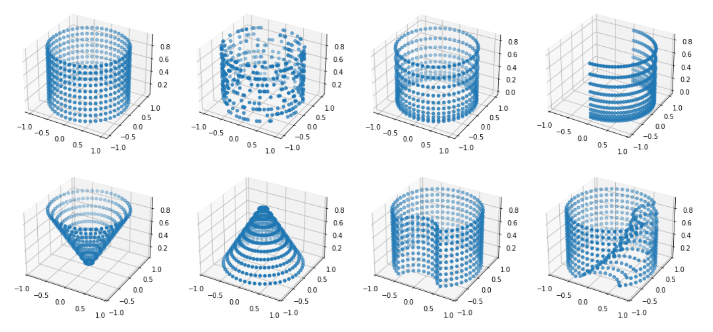

==============
Point Creation
==============
After the definition of the domains, the next part is the creation of training/validation points
in these domains. This task is handled by the **PointSampler**-class. Different kinds of sampling
are implemented, for example:

- ``RandomUniformSampler``: samples uniform randomly distributed points, in the given domain.
  To assure a efficent sampling, every domain implements are method to create random points.
- ``GridSampler``: samples a uniform point grid, in the given domain. Just like the 
  ``RandomUniformSampler`` loosely coupled with the domains, for efficiency.
- ``GaussianSampler``: creates points with a normal/Gaussian distribution.

And many more, see `sampler-docs`_. The samplers lay all under ``torchphysics.samplers``.

.. _`sampler-docs`: https://torchphysics.readthedocs.io/en/latest/api/torchphysics.problem.samplers.html

In general, a sampler gets the following arguments:

- **domain**: the domain in which the points should be created.
- **n_points** or **density**: to set the number of wanted points. Either a fixed number can be
  chosen or the density of the points.
- **filter**: A function that filters out special points, for example for local boundary conditions.

The ``PointSamplers`` were used to create the plots in previous tutorials. Random points can be
created with:

.. code-block:: python

  import torchphysics as tp
  X = tp.spaces.R2('x') # the space of the object
  R = tp.domains.Parallelogram(X, [0, 0], [1, 0], [0, 1]) # unit square
  C = tp.domains.Circle(X, [0, 0], 1) # unit circle
  random_R = tp.samplers.RandomUniformSampler(R, n_points=50) # 50 random points in R
  grid_C = tp.samplers.GridSampler(C, density=10) # grid points with density 10 in C

The above samplers will only create points **inside** each domain. If one wants points at the
boundary, you have to use ``.boundary``: 

.. code-block:: python

  random_R_bound = tp.samplers.RandomUniformSampler(R.boundary, n_points=50)
  grid_C_bound = tp.samplers.GridSampler(C.boundary, density=10)

Most samplers work for all domain types (operations and products included).
To visualize the structure of the points, a helper method ``.scatter`` is implemented. Which can
be used in the following way:

.. code-block:: python

  # first argument the space, afterwards all samplers:
  tp.utils.scatter(X, random_R, random_R_bound)

To create on batch of points, the ``.sample_points()`` method can be used. This functions
creates ``n_points`` (or density dependent) different points with the desired sampling strategy 
and returns the corresponding ``Points`` object:

.. code-block:: python

  created_points = random_R.sample_points()

The utilities of the ``Points`` objects were part of the `spaces and points tutorial`_.
As a general reminder, these ``created_points`` are essentially a dictionary with the 
different space variables as keys and PyTorch-tensors as values. To extract a stacked
PyTorch-tensor of all values, one can use the property ``.as_tensor``. Generally the 
``.sample_points()`` function will be called only internally.

The default behavior of each sampler is, that in each iteration of the trainings process new 
points are created and used. If this is not desired, not useful (grid sampling) or not
efficient (e.g. really complex domains) one can make every sampler ``static``. This will
create a sampler that only computes points once and afterwards always returns the same ones.

.. code-block:: python 

  static_sampler = grid_C.make_static()

These are the basics of the **PointSamplers**, but in general more complex point 
combinations/creations are needed. For this some special operations for the samplers are
implemented.

Sampler Operations
------------------
Different samplers can be combined by the following ways:

- **ConcatSampler**, with **'+'**. This will concatenate the output of two samplers. 
  For this, both samplers have to create points in the same space, but not essentially in
  the same domain. Useful if locally, different kinds of sampling should be used for
  the same condition. The number of points will be the sum of the points of each sampler.
- **AppendSampler**, with **.append**. This will create a *column stack* of the two sampler outputs.
  For this both samplers have to create the same number of points but in different spaces. 
  Useful if the points of both samplers have no real correlation between each other.
- **ProductSampler**, with :math:`\cdot`. Mathematically, this will create the Cartesian product of
  the sampler outputs. Numerically, this creates the mesh grid of the points. Therefore
  the number of points will be the product of the number of both samplers.
  The ``ProductSampler`` notices if one domain depends on the other one and will create
  the points accordingly.
  
For example, this:

.. code-block:: python 

  sum_sampler = random_R + random_R_bound

will lead to a sampler that creates points inside and on the boundary of the unit square.
The following gives a sampler, that creates grid points on the curved surface of a cylinder:

.. code-block:: python 

  T = tp.spaces.R1('t')
  I = tp.domains.Interval(T, 0, 1) # for the height of the cylinder
  C_sampler = tp.samplers.GridSampler(C.boundary, n_points=50)
  I_sampler = tp.samplers.GridSampler(I, n_points=10)
  cylinder_sampler = C_sampler * I_sampler # will have a total of 50*10=500 points

Everything can be visualized over the ``.scatter`` method.
Some possible combinations and results are in the following picture: 

Adaptive Sampling
------------------
A last important sampling strategy is the adaptive creation of points. These samplers will
compute new points depending on the loss, at each point, in the previous training iteration. 
The usage is the same as for all other samplers. What adaptive strategies are implemented can be 
found in the `sampler-docs`_.

Now you know all about the creation of points and can either go to the conditions or
definition of neural networks. Click here_ to go back to the main tutorial page. 

.. _`spaces and points tutorial`: tutorial_spaces_and_points.html
.. _here: tutorial_start.html