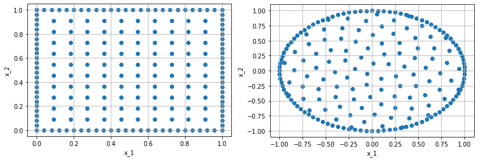
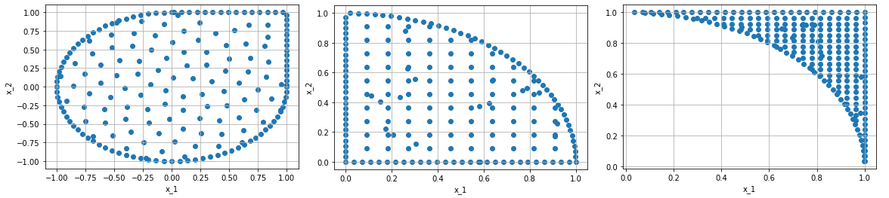
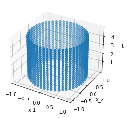
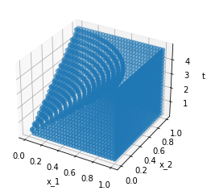

=============
Domain Basics
=============
In this file, we will explain the usage of the domain classes.
Every domain is a child of the main class **Domain** and implements
the following methods and properties:

- ``__contains__``: to check if a point lays inside this domain
- ``volume``, ``set_volume``: to compute or set the volume of the domain
- ``bounding_box``: to get a bounding box of the given domain
- ``boundary``: returns the boundary of the domain, this object itself is a domain and 
  implements the same methods. The boundary also knows the normal 
  vectors. But a boundary itself has **no** boundary!

For explicit documentation of each method and all implemented domains, see the docs_. 
All domains can be found under ``torchphysics.domains``.
Some pre implemented domains are: ``Point, Interval, Parallelogram, Circle...``

.. _docs: https://torchphysics.readthedocs.io/en/latest/api/torchphysics.problem.domains.html

Here we focus now on the creation of different domains. To create a domain,
we need a space to which the domain belongs. 
The definition of spaces were part of the `previous tutorial`_.

.. _`previous tutorial`: tutorial_spaces_and_points.html

You can find The following code as a notebook here_, if you want to try out something yourself.
To create the interval [0, 5]:

.. _here: https://github.com/boschresearch/torchphysics/blob/main/examples/tutorial/domain_creation.ipynb

.. code-block:: python

   import torchphysics as tp
   T = tp.spaces.R1('t') # we need a one dimensional space
   I = tp.domains.Interval(T, 0, 5)

To create the unit square or circle:

.. code-block:: python

   X = tp.spaces.R2('x') # we need a two dimensional space
   R = tp.domains.Parallelogram(X, [0, 0], [1, 0], [0, 1])
   C = tp.domains.Circle(X, [0, 0], 1)

If we want to get the boundary, we use ``.boundary``:

.. code-block:: python

   R_bound = R.boundary
   C_bound = C.boundary

Now it would be nice to look at the domains directly.
For this we have to use the **PointSamplers** which are part of the `next tutorial`_. 
There we will explain how to create the following plots.

.. _`next tutorial`: sampler_tutorial.html

The definition of other basic domains follow the same way.

Domain Operations
-----------------

Until now we only created simple geometries. For complex domains 
the following operations are implemented:

- ``Union`` :math:`A \cup B`, implemented with: ``'+'``
- ``Intersection`` :math:`A \cap B`, implemented with: ``'&'``
- ``Cut`` :math:`A \setminus B`, implemented with: ``'-'``
- ``Cartesian product`` :math:`A \times B`, implemented with: :math:`\cdot`

The only important aspect is that for union, intersection and cut the 
domains have to belong to the same space. The returning object is a child of
**Domains** and implements all previously mentioned methods. 
The operation can be used for an arbitrary number of times, 
but for complex domains, the creation of training points will possibly become costly and slow. 

.. code-block:: python

   union_domain = R + C
   intersection_domain = R & C
   cut_domain = R - C

The boundary can be again called with ``.boundary``. Since the operation can create 
complex domains the voluem can not always be computed. If a exact value is needed, 
one has to set it over the ``set_volume`` methode.

Again we can have a look at the corresponding geometries: 

For the product, we create the Cartesian product of an interval and circle to get a cylinder:

.. code-block:: python

   cylinder = C * I

The product domain will lay in the product of the spaces.
For example, the above cylinder lays now in the space :math:`X \cdot T`.
Here we only show the outer surface:

Changing Domains
----------------
The last aspect, is the possibility of variable domains. E.g. a domain that grows in time or 
a rotating circle. To this end, all parameters that define a domain can also be functions.
For example, the radius of the circle or the origin of a parallelogram.

Right now, a domain can only depend on the variables of another domain. So a domain that should
change with the trained solution is not possible, for now.

The creation of the domains stays the same, one has to only replace the desired parameters.

.. code-block:: python
   
   C = tp.domains.Circle(X, [0, 0], lambda t: t/5)

These domains can be used like all the other domains to create a product domain or apply an operation.

.. code-block:: python
    
   new_domain = R - C

If we now plot the product with the interval :math:`I`, we get:

These are all basic about the creation of different domains, next up is either the 
`creation of polygons and the loading of external objects`_, or the 
`creation  of training/validation points`_

.. _`creation of polygons and the loading of external objects`: external_domains.html
.. _`creation of training/validation points`: sampler_tutorial.html